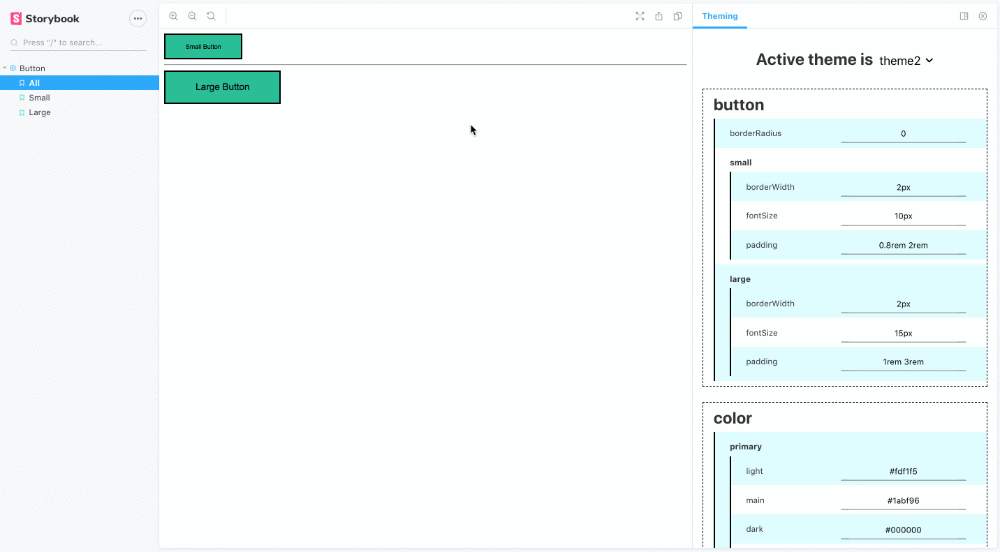

<div align="center">

# Storybook Theming Addon

<br/>


[](https://storybook.js.org/) [](https://github.com/styled-components/styled-components) [](https://github.com/airbnb/javascript) 

</div>

<br/>
<br/>

Storybook theming addon is a **theme playground and generator** for Storybook.

It provides a panel in Storybook which can be used to **tweak the theme values** of components and view the results in real-time. It can also be used to **review and export** the tweaked theme as a new theme, which can be added into the component library. The addon works with theme files of any React styling library.

<br/>
<br/>

<div align="center">

</div>

<br/>

## Table of Contents

- [Features](#features)
- [Installation](#installation)
- [Usage](#usage)
- [Exported Theme](#exported-theme)
- [Props](#props)
  - [themeProvider](#themeProvider)
  - [allThemes](#allThemes)
- [Links](#links)
- [Resources](#resources)

<br/>

<a name="features"/>

## Features

- Generate input fields based on theme.
- Modify theme values.
- View results of modified theme in real-time.
- Review the changes made to the theme.
- Export the modified theme as a new theme.
- Copy the modified theme to clipboard.

<br/>

<a name="installation"/>

## Installation

The addon is currently not published to any repository manager. To use it, clone the repository and run `npm pack` to generate a TGZ file. Place the **.tgz** file created, in your repository and install it as devDependency. To install run

```bash
npm i -D ./storybook-theming-addon-x.x.x.tgz
```

Replace the x.x.x with the version of the addon. Example: `0.7.1`.

<br/>

To clone the repo run

```bash
git clone ssh://git@stash.lbidts.com/~rnatesh/storybook-theming-addon.git
```

<br/>

<a name="usage"/>

## Usage

After installation, within `.storybook/main.js` add

```javascript
module.exports = {
  addons: ['storybook-theming-addon/register'],
};
```

<br/>

Within `.storybook/preview.js` add

```javascript
import { addDecorator } from '@storybook/react';
import { withTheming } from 'storybook-theming-addon/lib';
import { ThemeProvider } from 'your_styling_library'; // ThemeProvider from styling library used.
import * as allThemes from '../path_to_all_themes'; // import the themes available in your component library.

addDecorator(withTheming({ themeProvider: ThemeProvider, allThemes: allThemes }));
```

`withTheming` is a decorator that automatically wraps all your stories with the `ThemeProvider` that you have passed. So make sure that you **don't add the** `ThemeProvider` **explicitly** to your stories.

<br/>

If you do not want the `withTheming` decorator to wrap around all the stories, you can skip making changes to `preview.js` and instead you can add it to individual stories as

```javascript
import React from 'react';
import { withTheming } from 'storybook-theming-addon/lib';
import { ThemeProvider } from 'your_styling_library';
import * as allThemes from '../path_to_all_themes';

export default {
  title: 'Button',
  decorators: [withTheming({ themeProvider: ThemeProvider, allThemes: allThemes })],
};
...
```

After these steps the addon is all set-up. Happy theming!

<br/>

<a name="exported-theme"/>

## Exported Theme

After making changes and exporting the theme, the theme will be download as a `.zip` file with a structure similar to

```
theme.zip
    └── theme
          ├─── button.json
          ├─── color.json
          └─── index.js
```

<br/>

Separate `component.json` files will be created for each component. An `index.js` file will import all these individual theme files and export them as a single theme file. The `index.js` will look like

```javascript
import button from './button.json';
import color from './color.json';

export default {
  ...button,
  ...color,
};
```

<br/>

The `component.json` files will have structure to

```json
{
  "button": {
    "borderRadius": "0",
    "small": {
      "borderWidth": "1px",
      "fontSize": "13px",
      "padding": "0.5rem 1.5rem"
    },
    "large": {
      "borderWidth": "1px",
      "fontSize": "19px",
      "padding": "0.5rem 2rem"
    }
  }
}
```

<br/>

You can add the exported theme files into your library and make use of your new theme. Here is an example of making your theme files available to the library

```javascript
export { default as theme1 } from './theme1';
export { default as theme2 } from './theme2';
```

<br/>

<a name="props"/>

## Props

The `withTheming` decorator takes two props.

<a name="themeProvider"/>

- ### themeProvider

  Type: `function`

  Pass the ThemeProvider from the styling library used. This component wraps around the story.

<a name="allThemes"/>

- ### allThemes

  Type: `object`

  Pass an object containing all the themes available in the library. The fields generated in the panel will be based on this.

<br/>

<a name="links"/>

## Links

- A live working [demo](http://prototype.lbidts.com/rnatesh).
- See [changlog](./CHANGELOG.md) of this project.

<br/>

<a name="resources"/>

## Resources

- [Writing an addon](https://storybook.js.org/docs/addons/writing-addons/)
- [Creating addons](https://www.learnstorybook.com/intro-to-storybook/react/en/creating-addons/)
